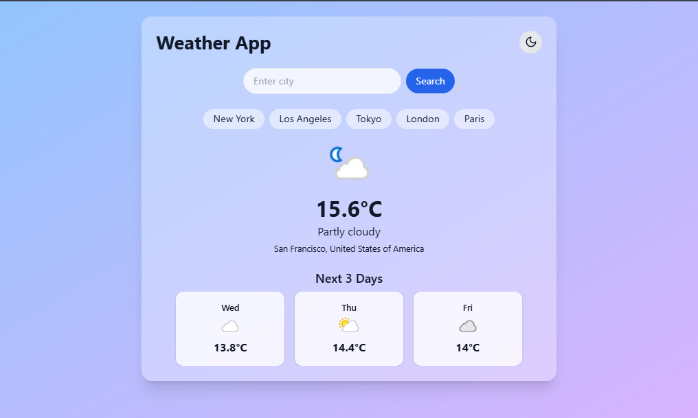

# 🌦️ Weather App

## 📌 Project Description

This is a sleek and responsive **Weather App** developed using **React.js**, designed to deliver real-time weather updates fetched from a public **Weather API**.

The application displays current weather conditions such as temperature, humidity, wind speed, and weather descriptions for any city the user searches. The app also includes a toggleable **dark/light theme**, enhancing user experience across different lighting environments.

### ✅ Key Features

- 🔍 **Search any city** to get real-time weather info  
- 🌡️ Displays **temperature**, **weather condition**, **humidity**, and **wind speed**  
- 🌓 Toggle between **Dark and Light Mode**  
- ⚡ Built with **React.js** for smooth, dynamic UI  
- 📱 Fully responsive design – works perfectly on desktop and mobile  

This project helped me practice API integration, component-based UI design, and responsive layouts in React.

## 🛠️ Tech Stack

- **Frontend**: React.js, Tailwind CSS
- **API**: OpenWeatherMap API 
- **Deployment**: GitHub Pages 

## 🚀 Live Demo

👉 [Click here to view the project](https://tahir1605.github.io/weather-app/)

---

